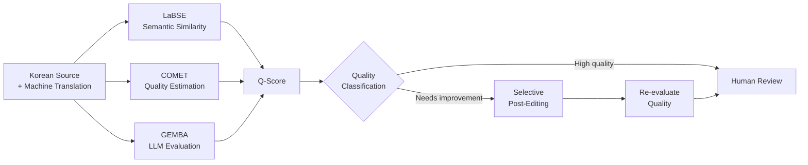

# WatchTower — Machine Translation Quality Evaluation

WatchTower is a **sanitized, condensed public demonstration** of a Korean-to-English machine-translation quality evaluation and selective post-editing workflow developed from an internship project.

> **Public-demo scope**
>
> This repository is **not** the company’s internal repository and does not contain proprietary production source code, internal datasets, credentials, deployment configuration, or non-public evaluation reports. The implementation here was reconstructed and condensed for portfolio demonstration while preserving the high-level engineering workflow.

## Overview



The demo combines three complementary quality signals:

- **LaBSE cosine similarity** for cross-lingual semantic preservation.
- **COMET** for learned reference-free translation quality estimation.
- **GEMBA-style LLM evaluation** for adequacy, fluency, terminology, and contextual issues.

The signals are normalized into a composite Q-Score. Lower-quality records can be selectively post-edited and then re-evaluated before final human review.

## Internship outcome

In the internship evaluation setup, the workflow demonstrated:

- automated evaluation throughput of up to approximately **2,500 sentences/hour**;
- a **68% quality-grade improvement rate** among post-edited translations.

These are internship-project results. They are not benchmarks of the small synthetic examples included in this public repository. Detailed internal experiments and non-public evaluation metrics are intentionally omitted.

## Repository structure

```text
.
├── README.md
├── docs/
│   └── ARCHITECTURE.md
├── examples/
│   ├── source_ko.json
│   ├── translation_en.json
│   └── termbase.json
└── watchtower/
    ├── run_pipeline.py
    ├── filter.py
    ├── gemba_batch.py
    ├── q_score.py
    ├── ape.py
    ├── validation.py
    ├── cfg.py
    ├── prompts/
    │   └── sparrow/
    └── requirements.txt
```

Only sanitized Sparrow-domain prompt examples are included. Other internal or experimental prompt variants are not part of the public demo.

## Quick start

```bash
git clone https://github.com/tkim602/WatchTower.git
cd WatchTower

python -m venv .venv
source .venv/bin/activate
pip install -r watchtower/requirements.txt

export OPENAI_API_KEY="your-key"
python watchtower/run_pipeline.py
```

By default the pipeline uses the synthetic files in `examples/`. You can point it to another dataset without editing source code:

```bash
export WATCHTOWER_SOURCE_JSON=/path/to/source.json
export WATCHTOWER_MT_JSON=/path/to/translation.json
export WATCHTOWER_TERMBASE_JSON=/path/to/termbase.json
export WATCHTOWER_LIMIT=100
```

The source and translation files use matching keys:

```json
{
  "resource.key": "sentence"
}
```

## Public-demo notes

- `OPENAI_API_KEY` is required for the LLM evaluation and automatic post-editing stages.
- LaBSE and COMET model downloads require network access on first use.
- The included example strings and termbase are synthetic/sanitized.
- Generated outputs, caches, local environments, and credentials are excluded from version control.
- This repository intentionally omits detailed internal research metrics, experiment artifacts, and proprietary company data.

For component responsibilities and data flow, see [`docs/ARCHITECTURE.md`](docs/ARCHITECTURE.md).
